# RUST VERSION CONTROL SYSTEM
A lightweight fast and secure version control systen written in Rust designed to manage and track changes in your projects locally.It offers essentials features for version control while maintaining simplicty and efficency.

## Features
Local Version Control: Keep track of changes without the need for a remote server.

Commit System: Save snapshots of your project with descriptive messages.

Branching: Create and manage branches to work on different features simultaneously.

Efficient Storage: Uses a delta-based system to store only changes between versions.

Rust-Powered: Built with Rust, ensuring safety and performance.

## Installation
### Prerequisites
Rust(install using rustup)
### Steps
1. Clone the repository
```bash
git clone https://github.com/yourusername/rust-vcs.git
cd rust-vcs
```
2. Build the project 
```bash
cargo build --release
```
3. Install the binary
```bash
cargo install --path
```

## Usage
Here, only porcelain commands are discussed.
### Initialize a repository
```bash
rvcs init
```
### Add files
```bash
rvcs add <file>
```

### Commit changes 
```bash
rvcs commit "commit_message"
```
### Status
```bash
rvcs status
```

### Diff 
```bash
rvcs diff  
```

### Create a new branch 
```bash 
rvcs branch <branch-name>
```

### Switch between branches
```bash
rvcs checkout <branch-name>
```

### Merge Branches
```bash
rvcs merge <branch-name>
rvcs merge -h
```
For discovering how to resolve conflicts.

## How the projects works 
RVCS wants implements a version control system very identical to git version control system. 
### What happens after Initialize a repository
```bash
rvcs init
```
After using this command, rvcs will create .vcs folder. How .vcs folder looks like after repository initialization?
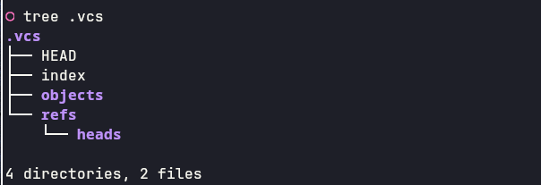

The HEAD file is where the app keeps the information about the current branch. 

The index file is where the app keeps the information about what files are added in the version control system.

The folder refs and subfolder heads, there the app keeps the branches that are created, default branch being main.

The objects folder, there are stored the actual objects of the app.RVCS have 3 types of objects, similat to Git:
    Blob : binary large object, it will be discussed more in the following commands
    Tree : is a type of data that can contain blobs , and trees
    Commit : this will be discussed in the following commands

### How add command actually works and what is happening in the background?
```bash 
rvcs add <file> 
```
After using this command, rvcs will create a new object of type blob in the folder .vcs/objects. How .vcs folder looks like after adding a file?
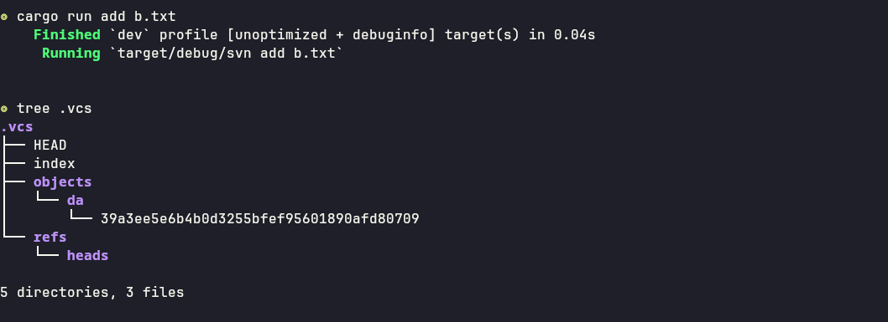
### How the blob is created? 
1. Reads the content of the file in our case b.txt.
2. Calculate the SHA1 hash of the file. 
3. In the folder objects a new folder will be created with the first two chars of the SHA1 hash calculated before, and inside will be a file with the remaining chars.
4. The content of the file will be compressed using zlib and will be added in the file created in the step 3.
5. The blob is added to index files with details like time of the last change, permissions and size.
You can see always what it is in the index file:
```bash
rvcs ls-files
```
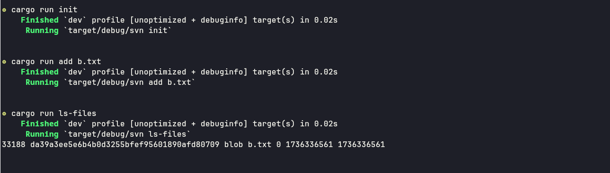
Moreover, you can always see what content has an object by using:
```bash
rvcs dec-object <object_hash>
```
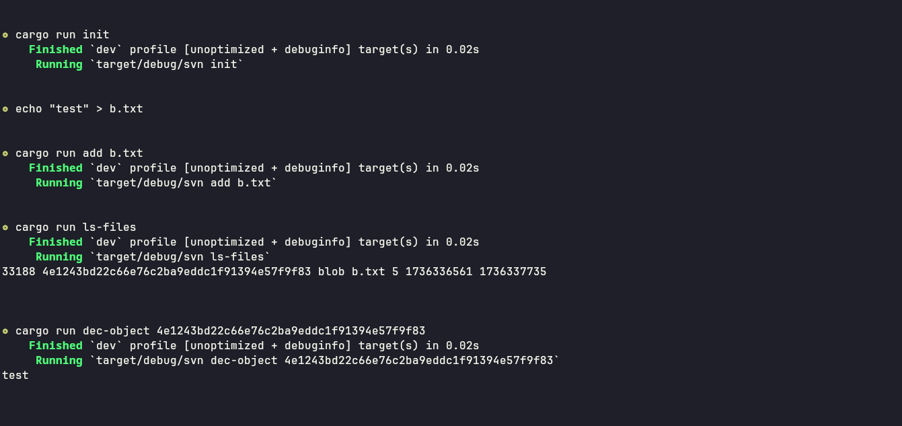
### How commits works and what is happening under the hood?
```bash
rvcs commit "commit message"
```
The commit command, will have the content of the current index file. Every commit object is keeping a reference of the current tree. 
Steps in creating a commit object: 
1. We need to create a tree object with the content of the current index file.This can be done with:
```bash 
rvcs write-tree
```
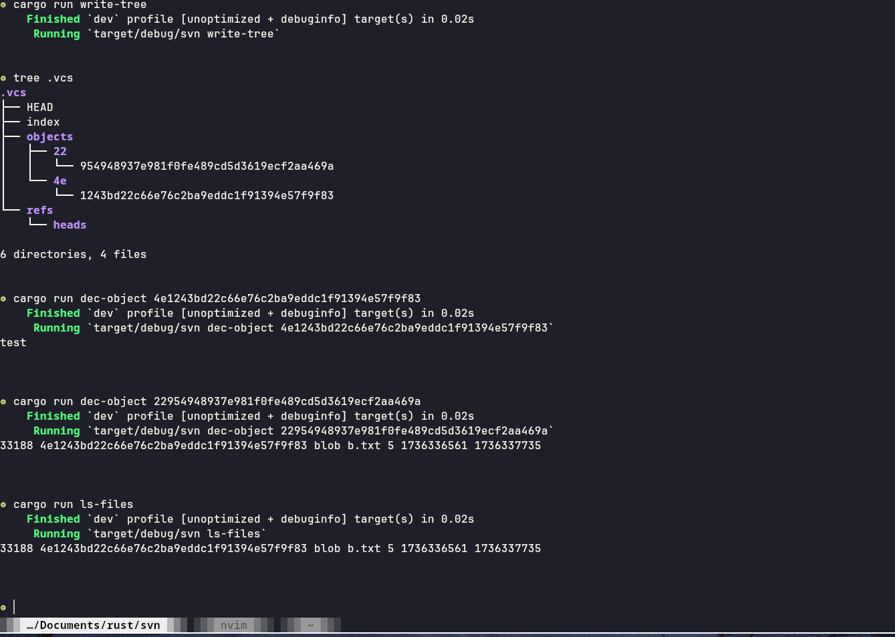
2. We create the commit object with the reference of the tree created in the first step.This can be done with: 
```bash
rvcs commit-tree <TREE_HASH> <COMMIT-MESSAGE>
```
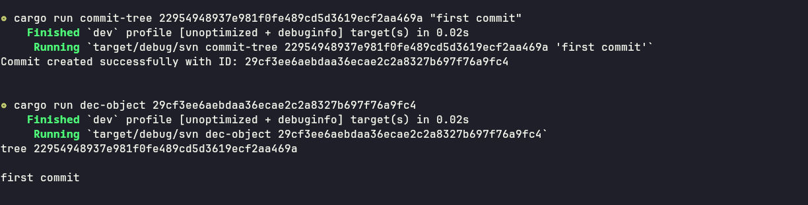

3. For the version control system to know about the commit we created at step 2, we need to update the current branch(default main) with the SHA1 hash value of the commit.

### How the .vcs folder looks like now?
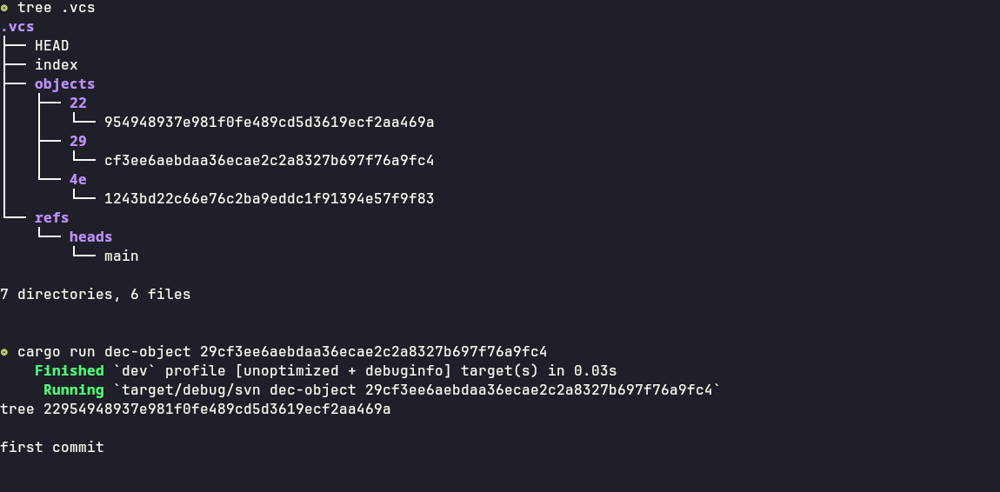

We made a commit without actually using:
```bash 
rvcs commit "commit message"
```

### How merge works?
RVCS uses three way merge and fast forward merge when it is possible. If a merge has conflicts it can be resolved by the program using the flag 'a':
```bash
rvcs merge -a <branch name>
```
There are two types of merges implemented in RVCS:
    1. Fast Forward Merge
    2. Three Way Merge

### Fast Forward Merge
```bash
rvcs ff-merge <branch_name1> <branch_name2>
```
A fast forward merge can occur when there is a linear path form current branch tip to target, that looks more like a linked list rather than a tree.No diverges happens between the current branch and the target branch.
To be more specific, one of the feature branch commit ancestors needs to be the main branch commit.
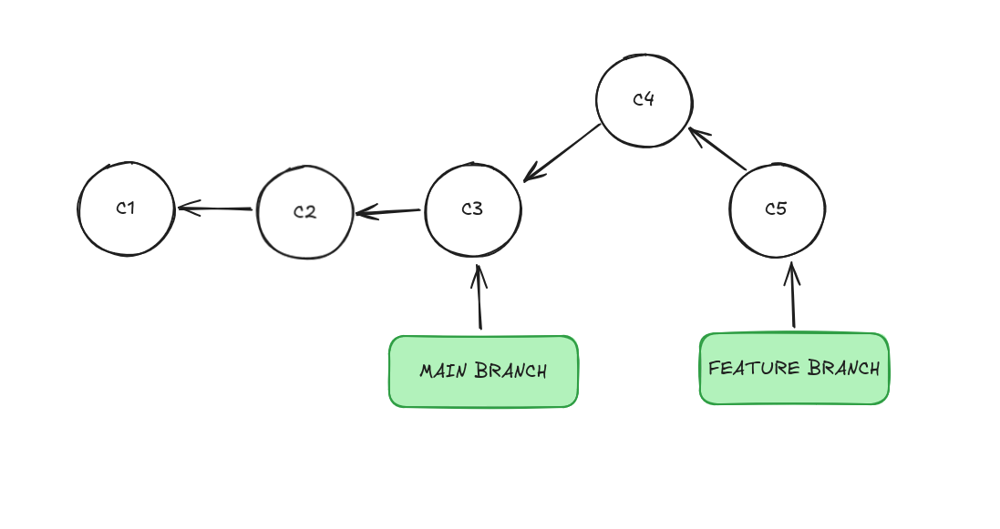
Instead of actually merging the branches, rvcs will movethe main branch to point out to the commit that the feature branch is pointing to. And than update all the files correspondly.
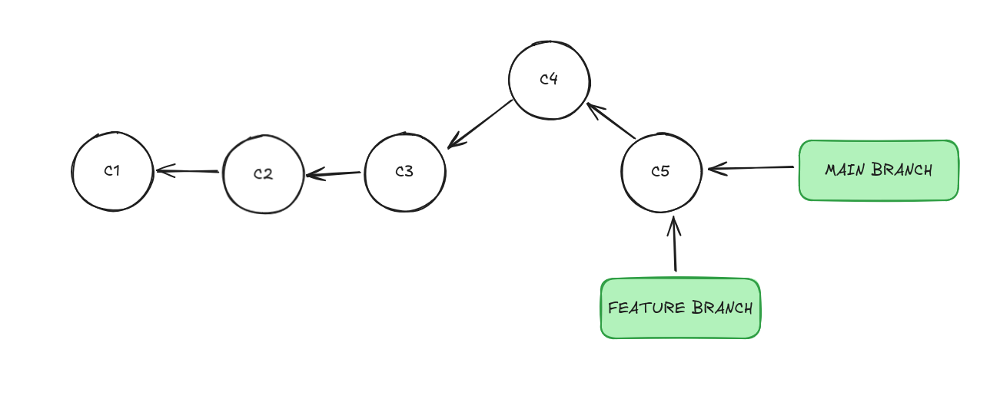

### Three Way Merge 
```bash
rvcs merge3 <branch_name1> <branch_name2>
```
A three way merge can occur where the path from current branch tip to target diverges and looks more like a tree, rather than a linked list.
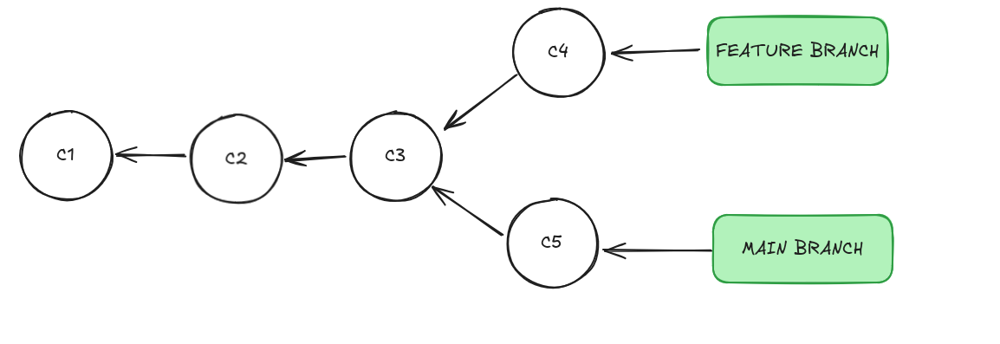
Steps of a three way merge: 

    1. Find the common ancestors of the two branches 
    
    2. Diff the files between the common ancestor and main branch 
    
    3. Diff the files between the common ancestor and feature branch 
    
    4. Check for conflicts and create a merge commit 

Steps in order to create a merge commit: 
    
    1. Create a merge tree between the commit of the main branch and the commit of the feature branch. We know that a tree is a content of the indexfile of one point in time, the merge tree will contain the contents of the trees that merged.
    
    2. Create the commit from the tree how we talked before. 
!!! Be aware that a merged commit will have more parents.
After doing the hardwork, the main branch will point to the new merged commit.
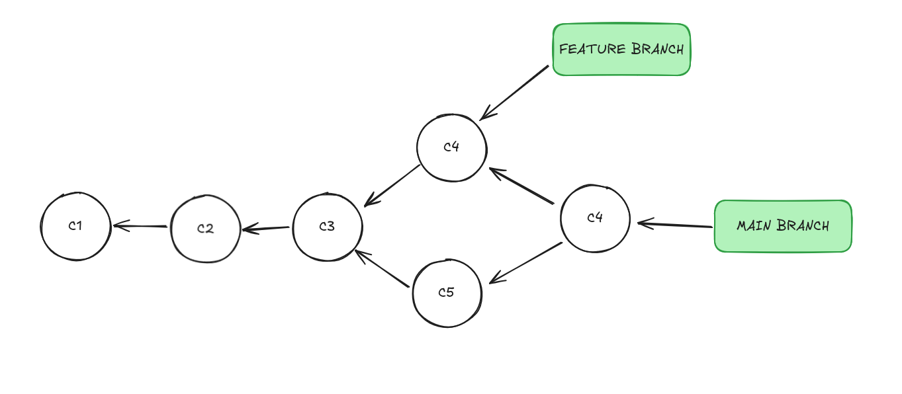

### Conflicts 
A conflict will occur when you are trying to merge two branches that modified the same file. You can resolve them by hand or enforce the rvcs resolve them: 
```bash
rvcs merge -a <branch_name>
```

## Bibliography
https://www.freecodecamp.org/news/git-internals-objects-branches-create-repo/

https://www.youtube.com/playlist?list=PL9lx0DXCC4BNUby5H58y6s2TQVLadV8v7

https://git-scm.com/

## License 

